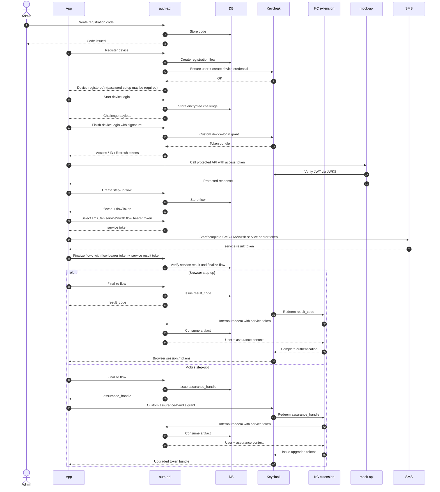

# auth-sandbox-2

Minimal device-login sandbox with Keycloak, OpenTofu, Caddy, Postgres, React frontends, and a Node.js auth API.

## What this repo does

`auth-sandbox-2` is a focused rebuild of the old sandbox with only the device-login flow:

- registration codes for a `userId`
- device registration with a stored Keycloak device credential
- backend-controlled password setup after registration when needed
- encrypted challenge login
- token display with decoded claims
- refresh and logout

Explicitly out of scope:

- SSO
- CMS
- extra demo or target apps

## Stack

- `auth-api` - Node.js + TypeScript + Fastify
- `app-web` - React + TypeScript device flow UI
- `mock-api` - Fastify demo REST API protected by Keycloak JWKS and audience validation
- `admin-web` - React + TypeScript admin UI
- `home-web` - React + TypeScript landing page
- `keycloak` - IAM and credential authority
- `postgres` - shared storage for auth-api and Keycloak with separate schemas
- `caddy` - local reverse proxy
- `opentofu` - Keycloak realm, client, scope, and flow config

## Local URLs

- `https://home.localhost:8443` - landing page
- `https://app.localhost:8443` - device app
- `https://admin.localhost:8443` - admin app
- `https://auth.localhost:8443/api/health` - auth API health
- `https://mock.localhost:8443/health` - mock API health
- `https://keycloak.localhost:8443` - Keycloak
- `https://db.localhost:8443` - Adminer Postgres viewer

## Main flow

1. Admin creates a registration code for a `userId`.
2. Device app registers a device with `userId`, `deviceName`, `activationCode`, and a signing public key.
3. Backend ensures the Keycloak user exists and stores a custom `device-login` credential in Keycloak.
4. Backend checks whether the Keycloak user already has a password.
5. If not, the app submits an initial password and the backend sets it via the Keycloak Admin API.
6. Device app requests an encrypted challenge from `auth-api`.
7. Device app signs the encrypted payload and sends it back.
8. `auth-api` exchanges the signed challenge at the Keycloak token endpoint with a custom OAuth grant, and Keycloak validates the custom device credential before issuing OIDC tokens.
9. App uses the access token to call `mock-api`, which verifies the token with Keycloak JWKS and the expected audience.
10. App shows access token, ID token, refresh token, decoded claims, and mock API responses.
11. App can refresh tokens and log out.



## Architecture notes

- Keycloak `username` always equals `userId`.
- The encrypted challenge remains mandatory in the login flow.
- No Keycloak Required Actions are used for this password flow.
- Keycloak configuration is managed through OpenTofu in `infra/tofu/keycloak`.
- The device login token exchange now uses a custom OAuth grant at `/protocol/openid-connect/token` instead of a browser redirect flow.
- The remaining custom Keycloak logic lives in `keycloak-extension`.
- Frontends are built statically and served by Caddy.

## Flow endpoint protection

- `POST /api/flows` remains the public flow-creation entrypoint.
- `GET /api/flows/:flowId`, `POST /api/flows/:flowId/select-service`, and `POST /api/flows/:flowId/finalize` require `Authorization: Bearer <flowToken>`.
- Direct identification endpoints require `Authorization: Bearer <serviceToken>` and return a `serviceResultToken` for finalization.
- Flow, service, and service-result tokens are HMAC-signed by `auth-api`, scoped to their intended use, and expire with the flow record.
- `POST /api/internal/flows/redeem` requires a Keycloak bearer token from the dedicated service-account client `auth-api-internal-redeem`.
- Redeem artifacts remain single-use, kind-checked, and expiry-checked even after bearer-token validation.

## Important paths

- `apps/auth-api` - backend API, DB migrations, Keycloak integration
- `apps/app-web` - device registration, login, claims, refresh, logout
- `apps/mock-api` - OIDC/JWKS protected mock REST endpoints for app-web
- `apps/admin-web` - registration code and device admin UI
- `apps/home-web` - landing page with links and flow diagram
- `packages/shared-types` - shared request and response types
- `keycloak-extension` - custom device credential and login authenticator
- `infra/tofu/keycloak` - realm and flow config
- `e2e` - Playwright coverage

## Run locally

1. Install workspace dependencies:

```bash
CI=true pnpm install
```

2. Build the local apps if needed:

```bash
pnpm build
```

3. Start the runtime stack:

```bash
bash scripts/generate-local-certs.sh
bash scripts/trust-local-ca-macos.sh
```

This sets up a fixed local CA and server certificate for all `*.localhost` hosts used by the sandbox.

4. Start the runtime stack:

```bash
podman compose up -d
```

Postgres has an extended shutdown grace period in `compose.yml` because Podman can otherwise interrupt long checkpoints and corrupt the local WAL during `down`/restart cycles. If an older local volume already fails with `invalid checkpoint record`, repair or reset that volume before starting the stack again.

5. Check the main health endpoint:

```bash
curl -k https://auth.localhost:8443/api/health
```

6. Open the Postgres viewer when you need to inspect the shared database:

- URL: `https://db.localhost:8443`
- System: `PostgreSQL`
- Server: `postgres`
- Username: `postgres`
- Password: `postgres`
- Database: `auth_sandbox_2`

Use the `auth_api` and `keycloak` schemas to inspect app data separately inside the same database.

## Quality checks

```bash
pnpm --filter auth-api test
pnpm --filter auth-api build
pnpm --filter mock-api build
pnpm --filter app-web build
pnpm --filter admin-web build
pnpm --filter home-web build
pnpm --filter @auth-sandbox-2/e2e test
```

## Current status

- End-to-end device flow works: register, set password, login, refresh, logout.
- Playwright covers homepage navigation plus the full device flow.
- Runtime uses one PostgreSQL database with separate schemas for `auth-api` and Keycloak.
