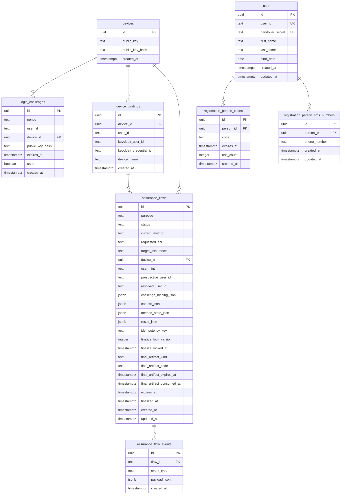

# auth_api Schema — Datenbankdiagramm

## Übersicht

Dieses Diagramm zeigt die Tabellenstruktur des `auth_api`-Schemas in der PostgreSQL-Datenbank der Sandbox. Es basiert auf den Migrationen `001_init.sql` bis `006_device_binding_names.sql`.

## Diagram

## Beziehungen

- `user` ist die zentrale Identitätstabelle. Sie enthält `handover_secret` — das persistente, zufällig erzeugte 32-Byte-Secret für den handover-v2-Workflow.
- `devices` enthält nur gerätebezogene Daten (Schlüsselmaterial, Hash) — keine Benutzerbindung und keinen Namen.
- `device_bindings` verknüpft ein `device` mit einem `user_id` und den Keycloak-Metadaten. Der `device_name` ist hier gespeichert und muss pro `(user_id, device_name)` eindeutig sein.
- `login_challenges` referenziert ein `device` für den verschlüsselten Challenge-Login-Prozess.
- `assurance_flows` referenziert ein `device` für Registrierungs-, Upgrade- und Step-up-Flows.
- `registration_person_codes` und `registration_person_sms_numbers` gehören zu einem `user`.

## Tabellen

| Tabelle | Zweck | Primärschlüssel | Fremdschlüssel |
|---|---|---|---|
| `user` | Personenidentität (Name, Geburtsdatum) + handover_secret | `id` (uuid) | — |
| `devices` | Gerätebasisdaten (Schlüssel, Hash) | `id` (uuid) | — |
| `device_bindings` | Verknüpft Gerät mit Nutzer und Keycloak-Metadaten | `id` (uuid) | `device_id` → `devices` |
| `login_challenges` | Verschlüsselte Login-Challenges mit Nonce | `id` (uuid) | `device_id` → `devices` |
| `assurance_flows` | Registrierungs-, Upgrade- und Step-up-Flows | `id` (text) | `device_id` → `devices` |
| `assurance_flow_events` | Flow-Ereignisprotokoll | `id` (uuid) | `flow_id` → `assurance_flows` |
| `registration_person_codes` | Einmalige oder wieder verwendbare Registrierungscodes | `id` (uuid) | `person_id` → `user` |
| `registration_person_sms_numbers` | SMS-basierte Verifizierung | `id` (uuid) | `person_id` → `user` |

## handover_secret

Das Feld `user.handover_secret` ist die Source of Truth für das kryptografische Handover-Secret. Es wird bei der ersten Geräteregistrierung erzeugt und in Keycloaals `secretData` des einen `device-login`-Credentials pro User gespiegelt.

## Dateien

- `README.md` — diese Datei mit eingebettetem Mermaid-Diagramm
- `diagram.mmd` — Mermaid-Quelltext (Source-of-Truth)