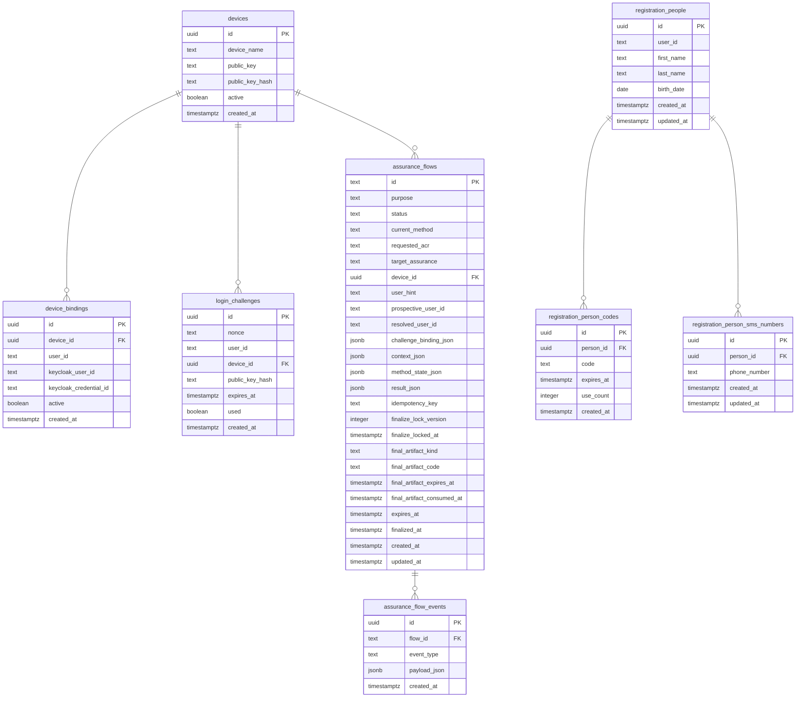

# auth_api Schema — Datenbankdiagramm

## Übersicht

Dieses Diagramm zeigt die Tabellenstruktur des `auth_api`-Schemas in der PostgreSQL-Datenbank der Sandbox. Es basiert auf den Migrationen `001_init.sql`, `003_devices_unbound.sql` und `004_device_bindings.sql`.

## Diagram

## Beziehungen

- `devices` ist die zentrale Tabelle. Sie enthält nur gerätebezogene Daten (Name, öffentlicher Schlüssel, Hash) — keine Nutzerbindung direkt.
- `device_bindings` verknüpft ein `device` mit einem `user_id` und den Keycloak-Metadaten. Ein Gerät kann mehrere Bindungen haben (historisch), aber nur eine ist `active = true`.
- `login_challenges` referenziert ein `device` für den verschlüsselten Challenge-Login-Prozess.
- `assurance_flows` referenziert ein `device` für Registrierungs-, Upgrade- und Step-up-Flows.
- `assurance_flow_events` protokolliert Ereignisse pro Flow.
- `registration_people` ist die Personentabelle mit Identitätsmerkmalen.
- `registration_person_codes` und `registration_person_sms_numbers` gehören zu einer Person.

## Tabellen

| Tabelle | Zweck | Primärschlüssel | Fremdschlüssel |
|---|---|---|---|
| `devices` | Gerätebasisdaten (Name, Schlüssel, Hash) | `id` (uuid) | — |
| `device_bindings` | Verknüpft Gerät mit Nutzer und Keycloak-Metadaten | `id` (uuid) | `device_id` → `devices` |
| `login_challenges` | Verschlüsselte Login-Challenges mit Nonce | `id` (uuid) | `device_id` → `devices` |
| `assurance_flows` | Registrierungs-, Upgrade- und Step-up-Flows | `id` (text) | `device_id` → `devices` |
| `assurance_flow_events` | Flow-Ereignisprotokoll | `id` (uuid) | `flow_id` → `assurance_flows` |
| `registration_people` | Personenidentität (Name, Geburtsdatum) | `id` (uuid) | — |
| `registration_person_codes` | Einmalige oder wieder verwendbare Registrierungscodes | `id` (uuid) | `person_id` → `registration_people` |
| `registration_person_sms_numbers` | SMS-basierte Verifizierung | `id` (uuid) | `person_id` → `registration_people` |

## Hinweis

Die einstige Nutzerbindung direkt auf `devices` (`user_id`, `keycloak_user_id`, `keycloak_credential_id`, `enc_pub_key`) wurde in Migration `004_device_bindings.sql` in die separate `device_bindings`-Tabelle verschoben. `devices` enthält nur noch gerätebezogene Daten.

## Dateien

- `README.md` — diese Datei mit eingebettetem Mermaid-Diagramm
- `diagram.mmd` — Mermaid-Quelltext (Source-of-Truth)
