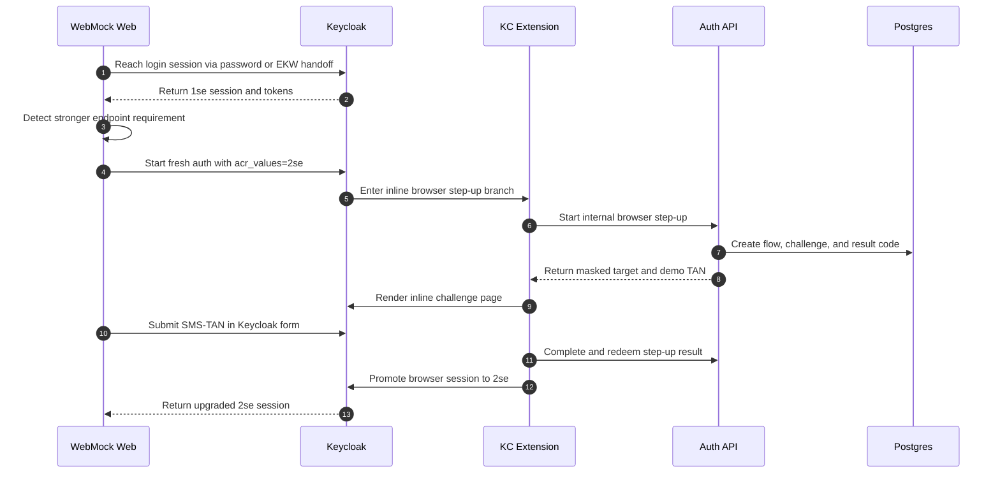

# Browser login and inline 2se step-up

## Summary

WebMock reaches 1se through password login, or receives a one-time EKW handoff that stays at acr=ekw, then Keycloak can upgrade the browser session to 2se through the inline SMS-TAN backchannel flow.

## Diagram

## Actors

WebMock Web, Keycloak, KC Extension, Auth API, Postgres

## Steps

1. **Reach login session via password or EKW handoff** (WebMock Web → Keycloak): WebMock acquires a 1se session through username/password login, or receives a one-time ekw handoff through the EKW bootstrap flow (webmock-ekw-login client → ekwmock IDP → prompt=none with webmock-web). The ekw handoff does not itself satisfy 1se.
2. **Return 1se session and tokens** (Keycloak → WebMock Web): Keycloak returns a browser session and tokens that satisfy 1se.
3. **Detect stronger endpoint requirement** (WebMock Web → WebMock Web): WebMock detects that a stronger endpoint still requires a 2se step-up.
4. **Start fresh auth with acr_values=2se** (WebMock Web → Keycloak): For step-up, WebMock sends the browser through a fresh OIDC authorization request with acr_values=2se against the webmock-web client so Keycloak can re-run the authentication flow and decide whether extra authenticators must execute.
5. **Enter inline browser step-up branch** (Keycloak → KC Extension): Keycloak routes the stronger request into the custom inline step-up branch. The browser-step-up-flow now handles only the 2se path; there is no LoA-1 subflow in this flow.
6. **Start internal browser step-up** (KC Extension → Auth API): The extension starts an internal SMS-TAN step-up flow for the current user through auth-api.
7. **Create flow, challenge, and result code** (Auth API → Postgres): Auth-api stores the step-up flow state, SMS challenge, and final result data.
8. **Return masked target and demo TAN** (Auth API → KC Extension): The extension receives the masked target and the challenge data needed for inline verification.
9. **Render inline challenge page** (KC Extension → Keycloak): Keycloak renders the inline SMS-TAN challenge inside the same browser login flow.
10. **Submit SMS-TAN in Keycloak form** (WebMock Web → Keycloak): The user submits the SMS-TAN directly in the Keycloak form.
11. **Complete and redeem step-up result** (KC Extension → Auth API): The extension completes the SMS-TAN step-up through auth-api and receives the stronger assurance result.
12. **Promote browser session to 2se** (KC Extension → Keycloak): The authenticator upgrades the active browser session to 2se before redirecting back to the client.
13. **Return upgraded 2se session** (Keycloak → WebMock Web): WebMock receives an upgraded browser session and tokens that satisfy 2se.

## Dateien

- `README.md` — diese Datei mit eingebettetem Mermaid-Diagramm
- `diagram.mmd` — Mermaid-Quelltext (Source-of-Truth)
