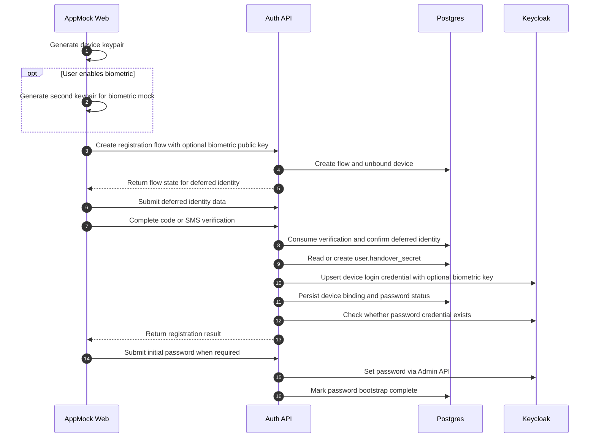

# Device registration and password bootstrap

## Summary

AppMock Web first creates an unbound device, then optionally generates a second biometric keypair, then attaches the user identity later in the same flow before the backend creates the single Keycloak `device-login` credential (containing all of the user's bindings, optionally including `biometricPublicKey`) and optional password bootstrap. The handover uses the persistent per-user secret stored in `user.handover_secret`.

**Key decision**: The biometric key is optional. Registration with `enableBiometric: false` produces a device that only supports password 2FA. Registration with `enableBiometric: true` generates a second local keypair (biometric private key stored in OS-protected keystore mock) and stores the `biometricPublicKey` in the Keycloak credential. This key can be added, rotated, or removed later via the biometric management flow (gated on strong authentication — successful 2FA login counts).

## Diagram

## Actors

AppMock Web, Auth API, Postgres, Keycloak

## Steps

1. **Generate device keypair** (AppMock Web): AppMock Web creates fresh RSA key material (RSASSA-PKCS1-v1_5, SHA-256, 2048-bit) and stores the private key locally in the OS-protected keystore mock. This is the device signing key for Factor 1.
2. **Generate second keypair for biometric mock** (AppMock Web, optional): If the user enables biometric during registration, AppMock generates a second RSA keypair. The biometric private key is stored in the OS-protected keystore mock (Secure Enclave / Keystore mock). The public key is passed to auth-api.
3. **createRegistrationFlow(deviceName, publicKey, biometricPublicKey?)** (AppMock Web → Auth API): AppMock Web creates the registration flow sending deviceName, the device publicKey, and optionally the biometricPublicKey.
4. **Create flow and unbound device** (Auth API → Postgres): Auth-api stores the registration flow, persists the standalone device first, and links the flow to that device before any user binding exists.
5. **Return flow state for deferred identity** (Auth API → AppMock Web): The client receives the flow token together with the persisted device state and can now submit person identity data later in the same flow.
6. **Submit deferred identity data** (AppMock Web → Auth API): AppMock Web sends userId, name, birth date, and optional phone number only after the device has already been created.
7. **Complete code or SMS verification** (AppMock Web → Auth API): AppMock Web selects person code or SMS-TAN, starts the chosen method when needed, and submits the entered code or TAN.
8. **Consume verification and confirm deferred identity** (Auth API → Postgres): The backend verifies the submitted code or TAN against the now-attached registration identity and marks the flow as finalizable.
9. **Read or create user.handover_secret** (Auth API → Postgres): On first registration for a user, auth-api generates a random 32-byte secret and stores it in `user.handover_secret`. On subsequent registrations, it reuses the existing secret.
10. **Upsert device-login credential with all bindings + biometricPublicKey** (Auth API → Keycloak): Only during finalization does auth-api upsert exactly one `device-login` credential for the user. The credential holds `version: handover-v2`, all `bindings` (each with `publicKeyHash` and `deviceName`), optionally `biometricPublicKey` in `credentialData`, and the per-user `handoverSecret` in `secretData`. Any previous credential for this user is replaced.
11. **Persist device binding and password status** (Auth API → Postgres): Auth-api writes the device binding (with `device_name`) and returns whether password setup is still required.
12. **Check whether password credential exists** (Auth API → Keycloak): After storing the device binding, auth-api fetches the user credentials from the Keycloak Admin API and checks whether any credential of type password already exists for the same user.
13. **Return registration result** (Auth API → AppMock Web): The app learns whether it can continue directly into device login or must complete backend-driven password setup first.
14. **Submit initial password when required** (AppMock Web → Auth API): If no password exists yet, the app sends the chosen password through auth-api instead of using Keycloak required actions.
15. **Set password via Admin API** (Auth API → Keycloak): Auth-api resolves the Keycloak user by username and calls the Admin API reset-password endpoint with temporary=false so the initial password becomes a normal stored password credential immediately.
16. **Mark password bootstrap complete** (Auth API → Postgres): The device binding is now treated as fully active, so the app can continue into encrypted login.

## Dateien

- `README.md` — diese Datei mit eingebettetem Mermaid-Diagramm
- `diagram.mmd` — Mermaid-Quelltext (Source-of-Truth)
