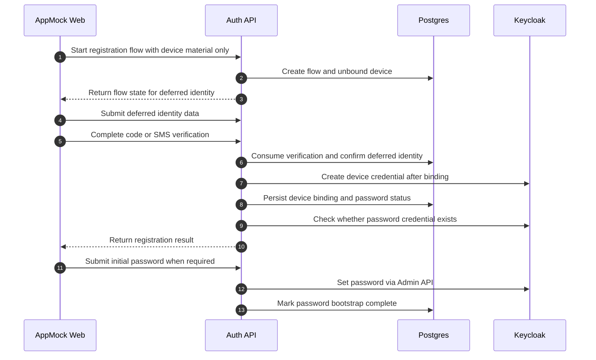

# Device registration and password bootstrap

## Summary

AppMock Web first creates an unbound device, then attaches the user identity later in the same flow before the backend creates the Keycloak credential and optional password bootstrap.

## Diagram

## Actors

AppMock Web, Auth API, Postgres, Keycloak

## Steps

1. **Start registration flow with device material only** (AppMock Web → Auth API): AppMock Web creates fresh device key material and sends only deviceName plus publicKey to auth-api. No userId, birthDate, or client-controlled requiredAcr is needed at this stage.
2. **Create flow and unbound device** (Auth API → Postgres): Auth-api stores the registration flow, persists the standalone device first, and links the flow to that device before any user binding exists.
3. **Return flow state for deferred identity** (Auth API → AppMock Web): The client receives the flow token together with the persisted device state and can now submit person identity data later in the same flow.
4. **Submit deferred identity data** (AppMock Web → Auth API): AppMock Web sends userId, name, birth date, and optional phone number only after the device has already been created.
5. **Complete code or SMS verification** (AppMock Web → Auth API): AppMock Web selects person code or SMS-TAN, starts the chosen method when needed, and submits the entered code or TAN.
6. **Consume verification and confirm deferred identity** (Auth API → Postgres): The backend verifies the submitted code or TAN against the now-attached registration identity and marks the flow as finalizable.
7. **Create device credential after binding** (Auth API → Keycloak): Only during finalization does auth-api ensure the user in Keycloak and create the custom device credential for the already persisted device.
8. **Persist device binding and password status** (Auth API → Postgres): Auth-api writes the user linkage into device_bindings and returns whether password setup is still required for the bound user.
9. **Check whether password credential exists** (Auth API → Keycloak): After storing the device binding, auth-api fetches the user credentials from the Keycloak Admin API and checks whether any credential of type password already exists for the same user.
10. **Return registration result** (Auth API → AppMock Web): The app learns whether it can continue directly into device login or must complete backend-driven password setup first.
11. **Submit initial password when required** (AppMock Web → Auth API): If no password exists yet, the app sends the chosen password through auth-api instead of using Keycloak required actions.
12. **Set password via Admin API** (Auth API → Keycloak): Auth-api resolves the Keycloak user by username and calls the Admin API reset-password endpoint with temporary=false so the initial password becomes a normal stored password credential immediately.
13. **Mark password bootstrap complete** (Auth API → Postgres): The device binding is now treated as fully activated, so the app can continue into encrypted login.

## Dateien

- `README.md` — diese Datei mit eingebettetem Mermaid-Diagramm
- `diagram.mmd` — Mermaid-Quelltext (Source-of-Truth)
