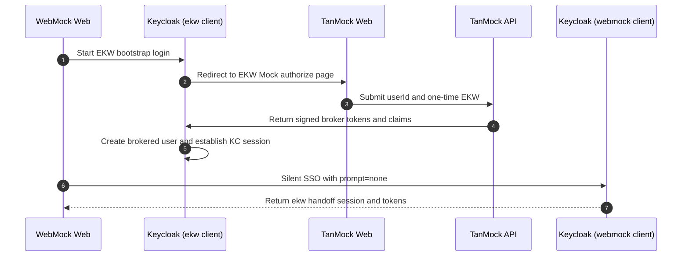

# EKW broker login into WebMock

## Summary

WebMock bootstraps a Keycloak session through the dedicated webmock-ekw-login client and browser-ekw-login-flow, then silently promotes that session to a single target-client handoff via prompt=none.

## Diagram

## Actors

WebMock Web, Keycloak (ekw client), TanMock Web, TanMock API, Keycloak (webmock client)

## Steps

1. **Start EKW bootstrap login** (WebMock Web → Keycloak (ekw client)): WebMock starts a browser authorization request against the dedicated webmock-ekw-login client with acr_values=ekw and state=ekw:<random>. The browser-ekw-login-flow checks for an existing Keycloak cookie first; if none is present it routes directly to the EKW Mock IDP.
2. **Redirect to EKW Mock authorize page** (Keycloak (ekw client) → TanMock Web): Keycloak sends the browser to the external EKW Mock authorization page for the brokered login.
3. **Submit userId and one-time EKW** (TanMock Web → TanMock API): The operator enters the configured userId plus one-time EKW and TanMock validates that this EKW is still active for that user.
4. **Return signed broker tokens and claims** (TanMock API → Keycloak (ekw client)): TanMock returns signed OIDC tokens whose broker claims include ekw_sub, source_user_id, allowed_target_client_id, copied profile data, and a unique broker email so Keycloak can treat the login as a new brokered identity.
5. **Create brokered user and establish KC session** (Keycloak (ekw client) → Keycloak (ekw client)): Keycloak runs the TanMock first-broker flow, creates the ekw_* user, links the federated identity, and establishes a Keycloak browser session marked with acr=ekw. The code is returned to WebMock but is not exchanged — the session cookie is all that matters here.
6. **Silent SSO with prompt=none** (WebMock Web → Keycloak (webmock client)): WebMock detects the ekw: state prefix in the callback and immediately starts a fresh authorization request against the webmock-web client with prompt=none and acr_values=ekw. Keycloak reuses the browser session from the EKW bootstrap exactly once for the configured target client.
7. **Return ekw handoff session and tokens** (Keycloak (webmock client) → WebMock Web): Keycloak issues a code for the webmock-web client. WebMock exchanges it for access, ID, and refresh tokens that carry acr=ekw and the brokered identity claims without satisfying 1se or 2se.

## Dateien

- `README.md` — diese Datei mit eingebettetem Mermaid-Diagramm
- `diagram.mmd` — Mermaid-Quelltext (Source-of-Truth)
