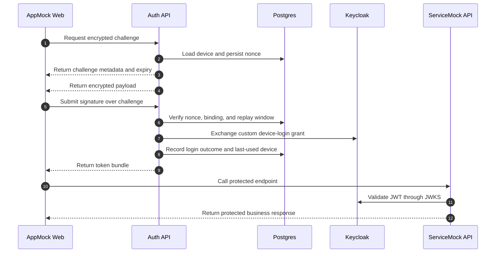

# Encrypted device login and protected API use

## Summary

A saved device turns the encrypted challenge into OIDC tokens and immediately uses them against the protected mock API.

## Diagram

## Actors

AppMock Web, Auth API, Postgres, Keycloak, ServiceMock API

## Steps

1. **Request encrypted challenge** (AppMock Web → Auth API): The app starts login by sending the stored public-key hash from the saved device binding.
2. **Load device and persist nonce** (Auth API → Postgres): Auth-api looks up the standalone device plus its active device_binding, creates a short-lived encrypted challenge, and stores the nonce for verification.
3. **Return challenge metadata and expiry** (Auth API → AppMock Web): The response includes the encrypted challenge data together with the nonce and expiry information.
4. **Return encrypted payload** (Auth API → AppMock Web): Only the registered device key can sign the payload that comes back to the browser.
5. **Submit signature over challenge** (AppMock Web → Auth API): The browser signs the base64-decoded encryptedData blob locally with the stored RSA private key using RSASSA-PKCS1-v1_5 plus SHA-256, then sends the signature together with nonce, encrypted payload parts, and IV without ever exporting the private key.
6. **Verify nonce, binding, and replay window** (Auth API → Postgres): Auth-api loads the login_challenges row by nonce, rejects unknown, used, or expired challenges, validates the RSA signature itself, and confirms that the active device_binding still matches userId, deviceId, and publicKeyHash.
7. **Exchange custom device-login grant** (Auth API → Keycloak): Auth-api marks the challenge as used and forwards a base64url login token into the custom device-login grant. Keycloak matches the credential by publicKeyHash and validates only the API-issued handover proof derived from the per-user handover secret; raw device public keys are not used there anymore.
8. **Record login outcome and last-used device** (Auth API → Postgres): The successful login updates the stored device usage state.
9. **Return token bundle** (Auth API → AppMock Web): The app receives the access, ID, and refresh tokens for the authenticated device session.
10. **Call protected endpoint** (AppMock Web → ServiceMock API): The access token is used immediately against the demo API to prove the issued session is usable.
11. **Validate JWT through JWKS** (ServiceMock API → Keycloak): Mock-api verifies the token signature and audience before returning the protected response.
12. **Return protected business response** (ServiceMock API → AppMock Web): The protected API returns a successful business response for the authenticated session.

## Dateien

- `README.md` — diese Datei mit eingebettetem Mermaid-Diagramm
- `diagram.mmd` — Mermaid-Quelltext (Source-of-Truth)
