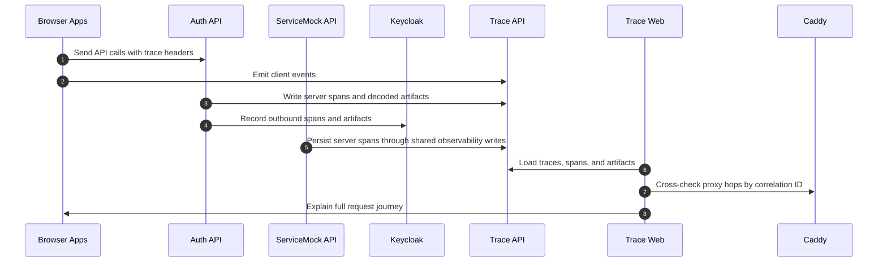

# Trace capture and inspection

## Summary

Browser clients, backend services, Keycloak calls, and proxy hops are stitched together through trace IDs, artifacts, and Caddy logs.

## Diagram

## Actors

Browser Apps, Auth API, ServiceMock API, Keycloak, Trace API, Trace Web, Caddy

## Steps

1. **Send API calls with trace headers** (Browser Apps → Auth API): Browser apps send their requests with trace and correlation headers so downstream calls can stay linked.
2. **Emit client events** (Browser Apps → Trace API): Browser clients also emit client events so trace records include the originating user action.
3. **Write server spans and decoded artifacts** (Auth API → Trace API): Auth-api writes server spans and artifacts into the shared trace store while preserving the incoming trace IDs.
4. **Record outbound spans and artifacts** (Auth API → Keycloak): Outbound Keycloak calls are recorded as nested spans so the cross-service flow stays connected.
5. **Persist server spans through shared observability writes** (ServiceMock API → Trace API): Protected downstream services keep the same trace chain and add their own server spans and artifacts.
6. **Load traces, spans, and artifacts** (Trace Web → Trace API): Trace Web loads traces, spans, and artifacts from Trace API for inspection.
7. **Cross-check proxy hops by correlation ID** (Trace Web → Caddy): Trace Web can also compare proxy hops from Caddy with the recorded trace chain.
8. **Explain full request journey** (Trace Web → Browser Apps): The final trace view combines the recorded events and spans into one request journey across the sandbox.

## Dateien

- `README.md` — diese Datei mit eingebettetem Mermaid-Diagramm
- `diagram.mmd` — Mermaid-Quelltext (Source-of-Truth)
